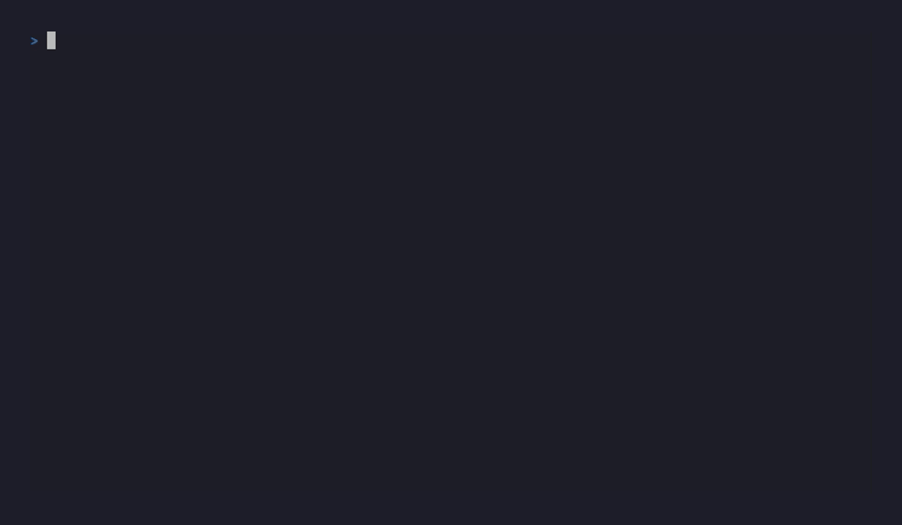

<h1 align="center">KeyHog</h1>

<h3 align="center">The fastest, most accurate secret scanner. Built in Rust.</h3>

<p align="center">
  <a href="https://crates.io/crates/keyhog"></a>
  <a href="LICENSE"></a>
  <a href="https://github.com/santhsecurity/keyhog/actions"></a>
</p>



---

KeyHog scans source trees, git history, Docker images, S3 buckets, and web assets for leaked credentials. It compiles **889 embedded detectors** into a single Hyperscan NFA database, decodes nested encodings before matching, scores findings with ML confidence + Bayesian Beta(α,β) calibration, and routes scans to the fastest hardware backend available:

| Backend | When | How |
|---|---|---|
| `gpu-zero-copy` | Discrete GPU detected | vyre AC automaton on GPU cores; cudagrep NVMe-to-GPU DMA |
| `simd-regex` | Hyperscan + AVX-512/AVX2/NEON | Parallel NFA multi-pattern matching at ~500 MB/s |
| `cpu-fallback` | No SIMD, no GPU | Aho-Corasick prefix + regex extraction |

Selection is automatic. On startup:

```
KeyHog v0.5.10 | 16 cores | SIMD: AVX-512 | Hyperscan | 889 detectors (1676 patterns)
```

## Performance

Measured head-to-head against every major secret scanner:

| | KeyHog | Gitleaks | BetterLeaks | TruffleHog | Titus |
|---|---|---|---|---|---|
| **Recall** (25-secret benchmark) | **96%** | 72% | 72% | 28% | 32% |
| **False positives** (Django, 0 real secrets) | **1** | 0 | 0 | 0 | 17,481 |
| **Speed** (Django 86 MB) | **0.5s** | 0.3s | 0.2s | 1.4s | 2.3s |
| **Speed** (Kubernetes 397 MB) | **1.1s** | - | - | - | 3.5s |
| **Speed** (large monorepo) | **2.5s** | - | - | - | 252s |

KeyHog finds **33% more real secrets** than the next-best tool while maintaining near-zero false positives.

### Why higher recall

- **Generic key=value scanner** with entropy gating catches `API_SECRET=<high-entropy>` without the FP explosion of broad regex patterns
- **Multiline reassembly** detects secrets split across lines (`"sk-proj-" + \` continuation)
- **Decode-through scanning** finds base64-encoded secrets in Kubernetes manifests, CI configs, and minified JS
- **Entropy fallback** catches secrets near `password`, `token`, `secret` keywords even without a named detector
- **889 service-specific detectors** with checksum validation (GitHub CRC32, npm, Slack, PyPI)

### Why fewer false positives

- **Confidence scoring** (0.0-1.0) gates every finding: entropy, context, companion, checksum, ML
- **Algorithmic placeholder detection** suppresses `EXAMPLE`, sequential patterns, x-filler (no hardcoded credential lists)
- **Context-aware suppression**: test files, documentation, comments, encrypted blocks, go.sum checksums
- **Default threshold** of 0.3 filters low-quality matches without hiding real secrets

## Quick Start

```bash
# Install
cargo install keyhog

# Scan a directory
keyhog scan .

# Scan with live verification
keyhog scan . --verify

# Scan git history
keyhog scan --git-history .

# JSON output for CI
keyhog scan . --format json

# SARIF for GitHub code scanning
keyhog scan . --format sarif -o keyhog.sarif

# Pre-commit hook
keyhog hook install
```

## Installation

```bash
# Recommended (includes SIMD, ML, entropy, decode, multiline)
cargo install keyhog

# With GPU acceleration
cargo install keyhog --features gpu

# From source
git clone https://github.com/santhsecurity/keyhog.git
cd keyhog && cargo install --path crates/cli
```

Works on **Linux**, **macOS** (Intel + Apple Silicon), and **Windows** with zero configuration.

## Usage

```bash
keyhog scan .                          # Scan directory
keyhog scan --stdin < .env             # Scan stdin
keyhog scan --git-staged               # Pre-commit (staged files only)
keyhog scan --git-diff main            # Changes since branch point
keyhog scan --git-history .            # Full git history
keyhog scan . --severity high          # Filter by severity
keyhog scan . --min-confidence 0.5     # Raise confidence threshold
keyhog scan . --show-secrets           # Show full credentials (not redacted)
keyhog scan . --fast                   # Skip ML/decode/entropy (pre-commit speed)
keyhog scan . --deep                   # Maximum detection depth
```

### Baselines

```bash
keyhog scan . --create-baseline .keyhog-baseline.json
keyhog scan . --baseline .keyhog-baseline.json          # Only new findings
keyhog scan . --update-baseline .keyhog-baseline.json   # Add new, keep old
```

### Output formats

| Format | Flag | Use case |
|---|---|---|
| Text | `--format text` | Terminal (default) |
| JSON | `--format json` | CI integrations |
| JSONL | `--format jsonl` | Streaming pipelines |
| SARIF | `--format sarif` | GitHub Advanced Security (CWE-798 + OWASP A07:2021 taxa) |

### Other subcommands

```bash
# Inspect detectors (889 in the embedded corpus)
keyhog detectors --search aws --verbose       # Filter + spec dump
keyhog explain aws-access-key                  # Spec, regex, severity, rotation guide

# Compare scan results
keyhog diff before.json after.json             # NEW / RESOLVED / UNCHANGED for CI gates

# Daemon mode: sub-100ms re-scan on save
keyhog watch ./src                             # inotify/FSEvents/RDCW recursive watch

# Bayesian Beta(α,β) calibration (per-detector confidence multiplier)
keyhog calibrate --tp aws-access-key           # Record a true positive
keyhog calibrate --fp generic-api-key          # Record a false positive
keyhog calibrate --show                        # Posterior-mean bar chart per detector

# Shell completions (bash, zsh, fish, powershell, elvish)
keyhog completion zsh > "${fpath[1]}/_keyhog"

# Inspect detected hardware + scan-backend routing
keyhog backend                                 # Hardware caps + routing matrix
keyhog backend --probe-bytes $((300 * 1024 * 1024))  # What backend at 300 MiB?
KEYHOG_BACKEND=cpu keyhog scan .               # Force the cpu-fallback backend
KEYHOG_BACKEND=gpu keyhog scan .               # Force the gpu-zero-copy backend
KEYHOG_THREADS=8 keyhog scan .                 # Pin rayon worker count
```

### Backend auto-routing

KeyHog probes the host hardware once at startup and routes each scan to
`gpu-zero-copy`, `simd-regex`, or `cpu-fallback` automatically.

| Workload | Pattern count | Routed to |
|---|---|---|
| < 64 MiB | any | `simd-regex` (Hyperscan) |
| ≥ 64 MiB | ≥ 2000 | `gpu-zero-copy` |
| ≥ 256 MiB | any | `gpu-zero-copy` |
| any | any (no GPU / software fallback) | `simd-regex` |
| any | any (no SIMD/no Hyperscan) | `cpu-fallback` |

Override with `KEYHOG_BACKEND={gpu|simd|cpu}`. Per-OS GPU backend
preference: Windows → DX12, macOS/iOS → Metal, Linux/BSD → Vulkan.

### Lockdown mode (security-critical embeddings)

For deployments where keyhog runs inside a sealed environment (e.g.
[EnvSeal](https://github.com/santhsecurity/envseal)): the same machine
that holds the secrets, with no untrusted code on the box: pass
`--lockdown`:

```bash
keyhog scan . --lockdown
```

What `--lockdown` enforces:

- `mlockall(MCL_CURRENT|MCL_FUTURE)` on Linux: credentials never page
  to swap.
- `prctl(PR_SET_DUMPABLE, 0)` (always on, even outside lockdown):
  disables core dumps, ptrace, and `/proc/<pid>/mem` reads. macOS gets
  `PT_DENY_ATTACH`.
- Refuses to run if `~/.cache/keyhog/*` exists (would leak past
  findings on disk).
- Disables `--incremental` cache writes (would persist file-content
  hashes).
- Refuses `--verify` (would send credentials to outbound HTTPS).
- Refuses `--show-secrets` (would print plaintext credentials).
- Refuses to start if the kernel `coredump_filter` would dump
  anonymous pages.

The free protections (everything except mlock and the disk-cache
refusals) are always on: even without `--lockdown` keyhog binaries
disable core dumps and ptrace at startup.

### System-wide credential triage

```bash
keyhog scan-system --space 50G                  # Walks every drive, every git history
keyhog scan-system --space 1T --include-network # Also scan NFS / SMB mounts
keyhog scan-system --space 10G --no-git-history # Skip git history (faster)
keyhog scan-system --space 50G --output findings.json
```

`scan-system` enumerates every mounted drive (skipping pseudo-FS like
`/proc`, `/sys`, `tmpfs`, `nsfs`, `fuse.snapfuse`), auto-discovers
every `.git` directory (worktrees + bare repos + submodules), and
runs the same scan + git-history pipeline that `keyhog scan
--git-history` uses on each. Honors a hard `--space <bytes>` ceiling
(default 50 GiB; supports `K`/`M`/`G`/`T` suffixes).

Ignores `.gitignore` by default: system scans are paranoid because
an attacker stashing a leaked key would `.gitignore` it. Add
`--respect-gitignore` if you want normal-scan behavior. Always
applies the always-on hardening, even outside `--lockdown`.

### `.keyhogignore` allowlist

Two syntaxes coexist. Use whichever is shorter for the case:

**Gitignore-style shorthand** — bare path globs and bare 64-char hex hashes,
just like `.gitignore`. The common case is dropping a copied-over `.gitignore`
and having it work:

```
# Just the glob — interpreted as path:
*.log
node_modules/
vendor/**/*.json
# Bare 64-char hex — interpreted as hash:
9d6060e21ef8d5daec9cfe4a44b1b1bc9792246bfad28210edaaa1782a8a676a
```

**Explicit prefixes** — keep these when you want the governance metadata
(`reason` / `expires` / `approved_by`) or to suppress by detector id:

```
hash:9f86d081…    ; reason="rotated 2026-04-25"; expires=2026-07-01; approved_by="security@acme"
detector:demo-token
path:**/fixtures/*.env
```

Entries past `expires` are silently dropped on load (with a warning).

### Diff-aware severity

When scanning git history (`keyhog scan --git-history`), findings whose blob
OID is reachable from `HEAD` keep their detector's declared severity (live
leak: an attacker can `grep` it from `main`). Findings only present in
older commits get downgraded one tier (Critical → High, etc.): they're still
reported, but ranked below live leaks.

### Incremental scan (CI re-runs)

```bash
keyhog scan . --incremental                              # Default cache path
keyhog scan . --incremental --incremental-cache .keyhog-merkle.json
```

Persists a BLAKE3 Merkle index of file hashes to `~/.cache/keyhog/merkle.idx`;
unchanged files skip the scanner entirely on subsequent runs. 10–100× speedup
on a typical CI loop.

## Library API

```rust
use keyhog_core::{Chunk, ChunkMetadata, DetectorSpec, PatternSpec, Severity};
use keyhog_scanner::CompiledScanner;

let detectors = keyhog_core::load_detectors(Path::new("detectors"))?;
let scanner = CompiledScanner::compile(detectors)?;

let findings = scanner.scan(&Chunk {
    data: "TOKEN=demo_ABC12345".into(),
    metadata: ChunkMetadata::default(),
});
```

## Architecture

```
crates/
  core/       Detector loading, findings types, reporting (text/JSON/SARIF), allowlists
  scanner/    Hardware routing, Hyperscan, GPU, decode-through, entropy, ML, multiline
  sources/    File system, git (staged/diff/history), stdin, Docker, S3, GitHub org, web
  verifier/   Live credential verification against service APIs
  cli/        CLI binary, orchestration, baselines, benchmarks
```

The scanner compiles all 896 detector regexes into a single Hyperscan database (cached to disk), then runs a two-phase coalesced scan:

1. **Phase 1**: Parallel Hyperscan NFA scan on raw bytes via rayon. Non-hit files (typically 95%+) pay zero cost.
2. **Phase 2**: Full extraction on hit files only: regex capture groups, companion matching, confidence scoring, entropy gating, checksum validation.

## CI Integration

### GitHub Actions

```yaml
- uses: santhsecurity/keyhog/.github/actions/keyhog@v0.5.10
  with:
    path: .
    severity: high       # info | low | medium | high | critical
    format: sarif        # text | json | sarif | jsonl
    verify: 'false'      # set 'true' to live-verify findings against vendor APIs
```

The action auto-downloads a prebuilt linux-x86_64 / macos-aarch64
binary attached to the matching release tag (see
[`.github/workflows/release.yml`](.github/workflows/release.yml)) and
falls back to a `cargo build` from source when no asset matches the
host triple (e.g. Windows runners, or a ref that isn't a tagged
release). SARIF output is auto-uploaded to GitHub code-scanning when
`format: sarif`.

### Pre-commit

```yaml
repos:
  - repo: https://github.com/santhsecurity/keyhog
    rev: v0.5.0
    hooks:
      - id: keyhog
```

## Roadmap

### Recently shipped

- **Daemon mode.** `keyhog daemon start|stop|status` runs a long-lived
  scanner over a Unix socket (default `$XDG_RUNTIME_DIR/keyhog.sock`).
  `keyhog scan --stdin --daemon` amortizes the ~3 s `CompiledScanner::compile`
  cold start across many invocations — measured **105× speedup** (7 ms via
  daemon vs 740 ms in-process) on a real github_pat sample, same detector
  + hash + offset in both paths. Use it in pre-commit hooks, IDE save
  handlers, or any per-commit CI loop.
- **Gitignore-style `.keyhogignore`.** Bare globs (`*.log`, `node_modules/`)
  and bare 64-char hex hashes are accepted alongside the prefixed forms;
  lines that previously WARN'd + dropped now Just Work.
- **`--max-file-size` skip summary.** Files dropped by the size cap now emit a
  per-file WARN and an end-of-scan summary line ("N file(s) skipped: exceeded
  --max-file-size"), instead of vanishing silently into the walker's filter.
- **Live progress ticker.** Long scans paint a self-overwriting
  `scanning N/M chunks · K findings · t.t s` line on stderr every 250 ms;
  suppressed under `--stream` or when stderr isn't a TTY.
- **GPU as the default backend.** Auto-router picks `gpu` on hosts with a
  real (non-software) adapter; `--backend simd|cpu|mega-scan` are still
  available, `--backend invalid` is now rejected by clap with a clear
  PossibleValues error instead of being silently ignored.
- **Strict exit-code contract.** Nonexistent paths, unreadable files
  (`chmod 000`), and non-UTF-8 filenames all exit 2 with an actionable
  message, instead of WARN'ing + exit 0 (the prior behavior misled CI gates
  into reporting clean scans on bad inputs).
- **MegaScan no longer blows up on tiny inputs.** A 19-byte file used to
  trigger ~570 shard compiles × 256 MiB GPU upload = ~20 GB RSS; the
  small-buffer guard now degrades to the literal-set GPU dispatch for
  batches under 64 KiB (60× faster, 50× less memory).
- **25 companion-required detector contracts.** Per-detector TOMLs at
  `crates/scanner/tests/contracts/companion/` encode the three-shape
  contract (positive_with_companion, positive_primary_only with
  `must_not_verify`, negative_companion_lookalike) for every detector
  whose primary credential is useless without its companion (AWS,
  Twilio API key / auth-token / IoT, Algolia, Razorpay, Stripe, …).

### Next

Feedback / PRs welcome: file an issue to argue scope.

- **Hyperscan on Windows out of the box.** Today the `simd` feature is opt-in
  on Windows because `hyperscan-sys` requires a vcpkg/MSVC build of the
  upstream Hyperscan/Vectorscan C library (Linux/macOS users get it for free
  via system packages). The fallback AVX2 regex engine is correct but ~5–10x
  slower per pattern. Next: ship a vendored Hyperscan build profile in CI so
  `cargo install keyhog` on Windows lands the SIMD path automatically.
- **Real VRAM probe.** `wgpu` has no portable VRAM query, so the GPU report
  shows `max buffer size` (the per-buffer allocation cap, capped at 256 GB by
  the wgpu spec). Next: backend-specific probes, DXGI on Windows, NVML for
  NVIDIA, IOKit on macOS, to display the actual installed VRAM.
- **Native Apple-silicon / aarch64 binaries** in the GitHub release artifact
  matrix (currently x86_64-only). The code already compiles cleanly on
  aarch64 (NEON path tested in CI); the gap is the release pipeline.
- **Hyperscan stream mode + cross-process DB cache.** Today the database
  recompiles on every cold scanner; persistent cache exists for vyre's
  programs but not for Hyperscan. Stream mode would let large single files
  (HAR, multi-MB logs) scan incrementally instead of read-into-memory.
- **GPU↔CPU streaming pipeline.** Current orchestrator runs GPU dispatch on
  a batch, then CPU post-process on the same batch; the two phases are
  serial. Streaming would fork the post-process onto CPU as soon as a
  chunk's GPU dispatch finishes, overlapping GPU + CPU work.

## License

MIT
